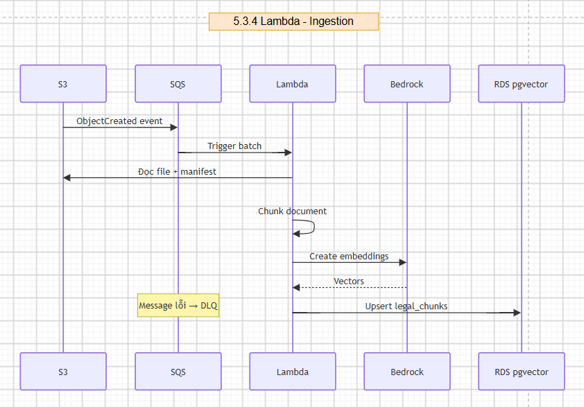
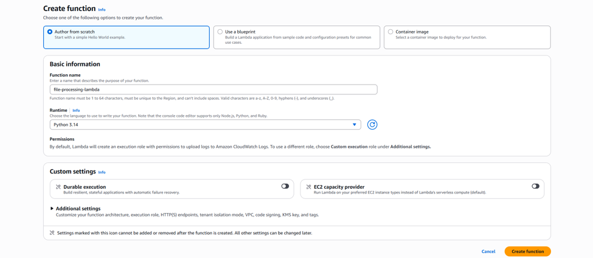
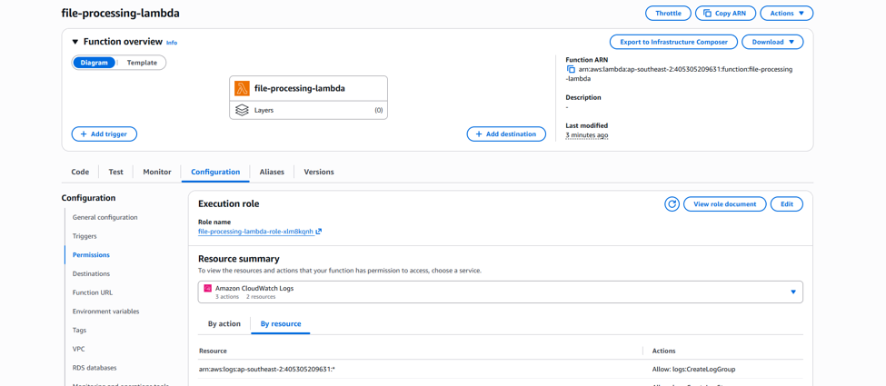

# Triển khai Lambda

## Tổng quan Sơ đồ Kiến trúc

## Các bước tạo Lambda

**Bước 1**
- Đặt tên cho Lambda function, chọn runtime là Python 3.14 rồi nhấn **Create function** để tạo.

**Bước 2**
- Sau khi tạo xong function, hãy nhấn vào phần **Role name**, tìm kiếm **AWSLambdaBasicExecutionRole** và chọn **Add Permissions** để gán quyền cho function.

**Bước 3**
- Tiếp theo, nhấn **Add trigger** để thêm trigger cho Lambda.

**Bước 4**
- Chọn **SQS**, sau đó chọn queue SQS vừa tạo (Main Queue), rồi nhấn **Create** để hoàn tất.

**Bước 5**
- Quay lại bucket S3, chuyển sang tab **Properties**.

- Tìm tới **Event notifications**, bấm **Create event notification**. Đặt tên thông báo, chọn **Prefix** là `uploads/` và chọn loại sự kiện là **All object create events**.

- Ở mục **Destination**, chọn **SQS Queue**, sau đó nhập **ARN** của queue SQS mà bạn muốn nhận sự kiện, rồi lưu thay đổi bằng cách nhấn **Save changes**.
